# DHCP DEBIAN RAMÓN SALGADO #
## 1.- Unha subrede para os equipos da rede privada stark.lan 192.168.10.0/24 con 2 pool. Un dos pool, asignará enderezos no rango entre .30 e .32 e outro no rango entre .101 e .230. Estes deberán ter como único servidor dns ao equipo arya##
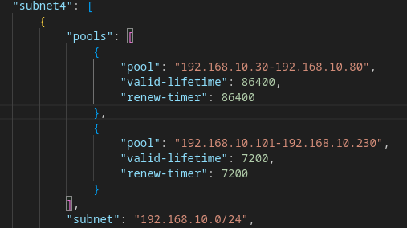

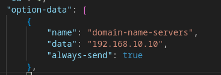

## 2.- Unha subrede para os equipos da rede privada lannister.lan 192.168.11.0/24 ##
pc4 estará aquí
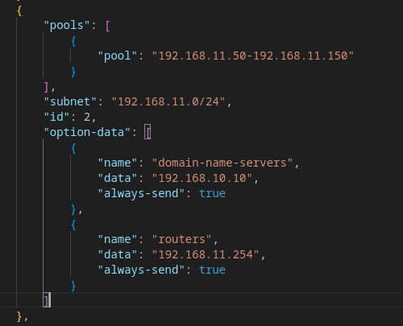

## 3.- Unha subrede para os equipos da rede privada targaryen.lan 192.168.57.0/24  (Conectado ao interface cloud sobre vboxnet1) ##

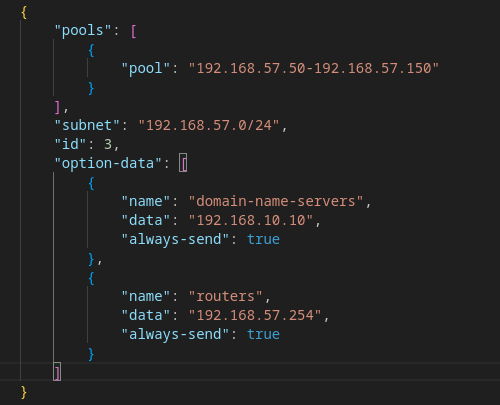

## 4.- Fai que os log, se amosen no ficheiro /var/log/dhcp.log##

Documentación: https://kea.readthedocs.io/en/kea-2.6.1/arm/logging.html

Configuramos en el dhcp4.json los loggers:
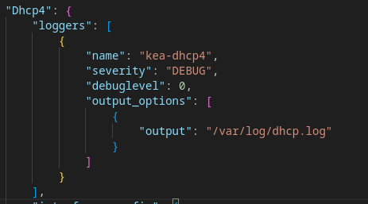

OJO: es output_options, NO -

Comprobamos logs con : kea-dhcp4 -t /dhcp/dhcp4.json o haciendo un cat /var/log/dhcp.log
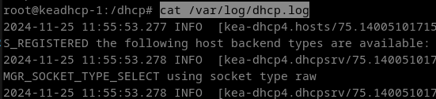

## 5.- Deberás crear unha reserva estática que estará no rango de enderezos do seu pool correspondente (para o equipo bran)##

Como las mac cambian cada vez que iniciamos el equipo, hacemos al reserva y comprobamos.
El equipo bran le ponemos en dhcp.
El DHCP le hacemos la reserva de esta manera:
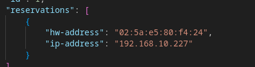
Desde el equipo Bran pedimos la ip con dhclient -v o dhclient -r para sacarla.

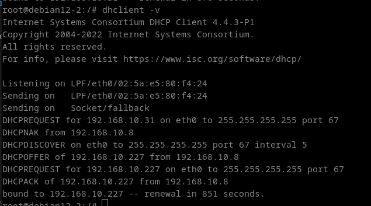

## Configuración relay en lannister.lan ##

sudo apt install isc-dhcp-relay

En nano /etc/default/isc-dhcp-relay :

INTERFACES="eth0"
SERVERS="192.168.10.8"

Esto lo añadimos a un entrypoint para que funcione.
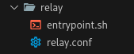

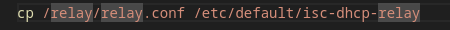

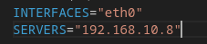

/etc/init.d/isc-dhcp-relay

FUNCIONA SIN PONER LA OPCIÓN DEL RELAY:

## 6.- Debe actualizar mediante chaves a zona primaria (directa e inversa) no servidor DNS arya.##
Documentación actualización dinámicas: https://manuais.pages.iessanclemente.net/apuntes/3.sistemas/dhcp/kea/20_actualizacions_dinamicas/index.html

tsig-keygen proba para generar una llave

IMPORTANTE: Los archivos db.loquesea deben tener permisos de bind. 
Por eso, en el entrypoint debemos darle permisos:
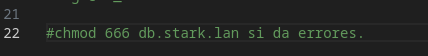

## 7.- Establece os nomes de dominio e servidores DNS  de cada zona.##
## 8.- Configura nos equipos ned e robb un servizo DHCP failover para a rede stark.lan  e para lannister.lan##
## 9.- Necesitarás polo menos catro clientes (bran, jon, sansha) para a rede stark e tres para a  rede lannister (jamie).
Inclúe capturas de:
Configuración (grep -v "^#" /etc/dhcp/dhcpd.conf)
log de ned visualizando a asignación de enderezos en cada un dos pool e da reserva estática
Configuración de servidores DNS, router e enderezo IP de cada cliente
log de ned e robb (simultáneos) facendo unha actualización mediante chaves en arya.
log de ned visualizando asignacións da segunda subrede (lannister) e actualizacións no servidor dns correspondente.
Log dos dous servidores failover cando dous clientes obteñen enderezos
Os dous funcionan correctamente e os clientes renovan a concesión
O primeiro co cable desconectado e o segundo contectado, e os clientes renovan a concesión.
O primeiro co cable conectado e o segundo desconectado, e os clientes renovan a concesión.
Clientes tres dúas subredes, amosando DNS, router e enderezo IP.##

## INFO ADICIONAL ##
Los VPCS del GNS3 tienen 2 comandos importantes:

 show para sacar la mac
 dhcp para coger una direccion ip.

para ver las concesiones en un equipo dhcp que recibió ip, es en leases.
/var/lib/dhcp/dhclient.leases

Para ejecutar el entrypoint automáticamente: 
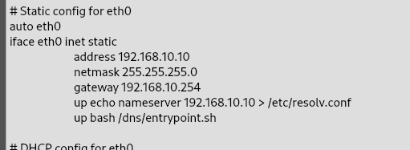

Configuración network router:
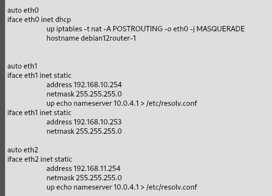

Para arrancar el relay en el router
dhcrelay -d -i eth2 -i eth3 -i eth1 192.168.10.8 (o algo así, revisarlo)

rsyslogd y despues reiniciamos proceso y hacemos /var/log/syslog para ver lo que ocurre en el pc.
